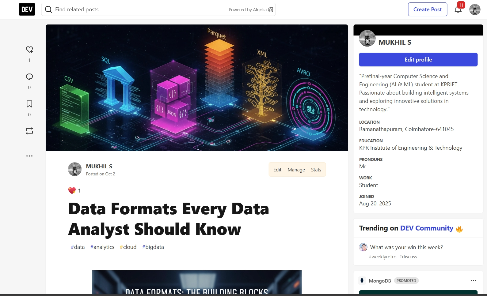
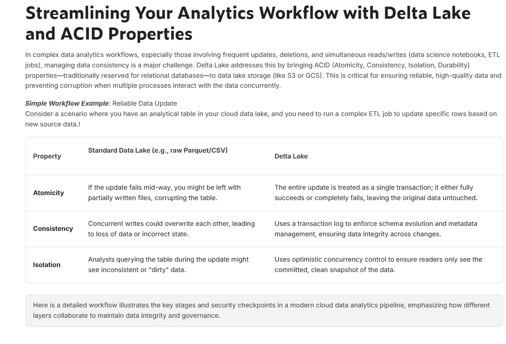
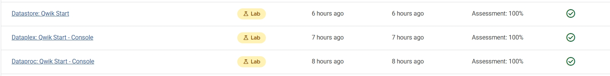
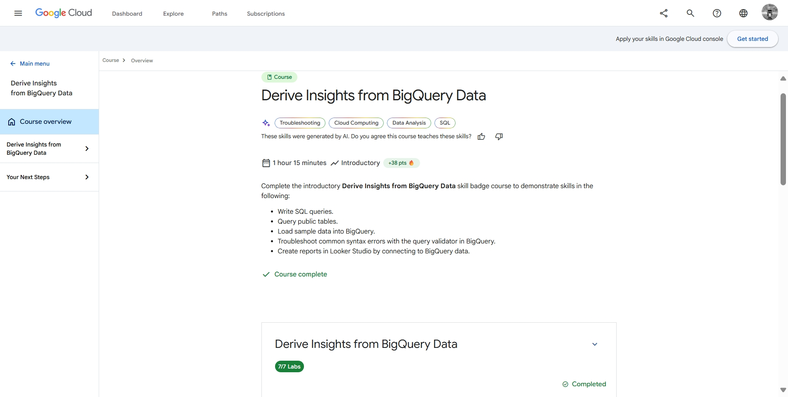
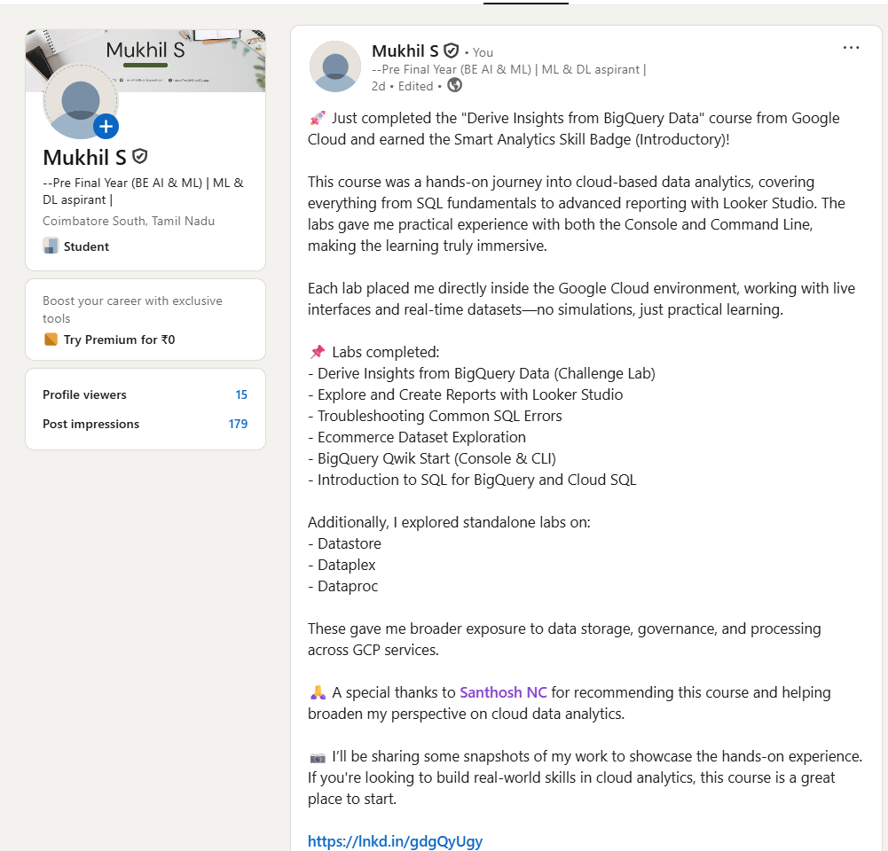

# Data Analysis in Cloud Computing – Assignment 2  

**Name:**  Mukhil S  

**Roll.No:**  23AM036  

**Department:**  B.E. CSE (AI & ML) – III Year      

## Assignment Overview

| S.No | Task                                  | Marks |
|------|---------------------------------------|:-----:|
| 1    | Dev.to Blog – *Data in Cloud*         | 5     |
| 2    | Kaggle Topic – *Discussions*          | 3     |
| 3    | Dataproc – *Qwik Start (Console)*     | 4     |
| 4    | Dataplex – *Qwik Start (Console)*     | 4     |
| 5    | Datastore – *Qwik Start*              | 4     |
| 6    | Derive Insights from *BigQuery Data*  | 20    |
|      | **Total**                             | **40** |

---

## 1. Dev.to Blog – Data Format
**Blog URL:** [Data Formats Every Data Analyst Should Know](https://dev.to/mukhil_77/data-formats-every-data-analyst-should-know-4f72)  

**Description:**  
The blog explores various data formats used in cloud environments, including CSV, SQL, JSON, Parquet, XML, and Avro. It explains how these formats impact storage efficiency, query performance, and interoperability across cloud data systems.  

**Screenshot:**  

---

## 2. Kaggle Topic – Discussions  
**Discussion URL:** [Streamlining Analytics with Delta Lake and ACID](https://www.kaggle.com/discussions/getting-started/610206)  

**Summary:**  
This Kaggle discussion highlights how Delta Lake enables ACID transactions and schema enforcement for data lakes. It focuses on reliability and scalability improvements in big data analytics workflows.  

**Screenshot:**  

---

## 3–5. Qwik Start Labs  
Hands-on labs from Google Cloud Skills Boost platform:

| No | Lab Name                      |
|----|--------------------------------|
| 3  | Dataproc: Qwik Start – Console |
| 4  | Dataplex: Qwik Start – Console |
| 5  | Datastore: Qwik Start          |

**Screenshot:**  

---

## 6. Derive Insights from BigQuery Data  
**Badge URL:** [Derive Insights from BigQuery Data](https://www.cloudskillsboost.google/public_profiles/9a6f4ff9-3893-4f36-b79c-177cdf1d5eab) 

**Credly Badge URL:** [Credly badge](https://www.credly.com/badges/c57a8d5e-5c07-4f1b-8e83-322c230111a9/public_url) 

**Key Learnings:**  
- Data loading and querying in BigQuery using SQL  
- Aggregations and filtering on large datasets  
- Performance optimization with partitioned and clustered tables  
- Visualizing insights using Data Studio  

**Screenshot:**  

---

## Optional – LinkedIn Post  
**LinkedIn URL:** [Derive Insights from BigQuery Data – post](https://www.linkedin.com/posts/mukhil77_googlecloud-bigquery-sql-activity-7379909100127780864-T_OK?utm_source=share&utm_medium=member_desktop&rcm=ACoAAEbPWzkBgNUq0zn8FBNvDdMch5DnBKHhDVc)  

**Description:**  
A professional post showcasing completion of the BigQuery lab and other labs related to qwik lab.  

**Screenshot:**  

---

## Summary
This assignment demonstrates practical understanding of cloud-based data tools, including data storage, processing, and analytics using Google Cloud. The combination of blog writing, discussions, and hands-on labs reflects both theoretical knowledge and applied technical skills.
